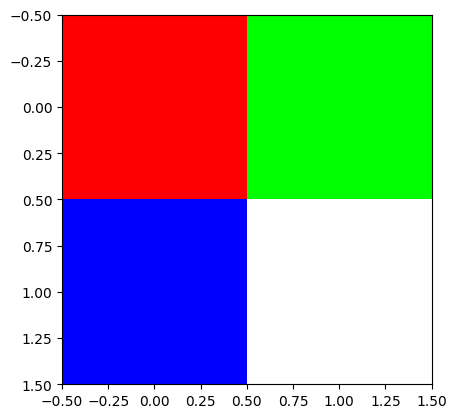
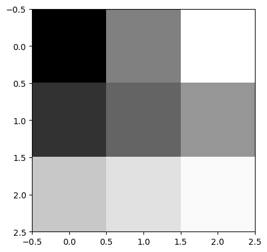
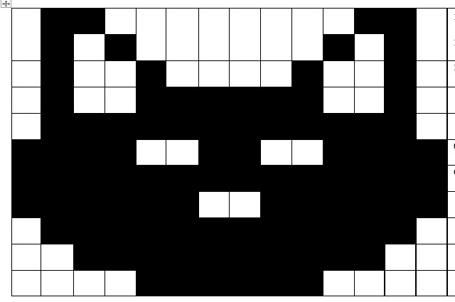

+++
author = "Puja Chaudhury"
title = "Understanding Images and Pixels"
date = "2023-08-02"
description = "A Comprehensive Understanding of Images and Pixels"
image = "bg.jpg"
+++

## Understanding Images

In the simplest terms, a digital image is a pictorial representation of data, an array of pixels displayed on a digital screen. A pixel, short for "**picture element**" is the smallest controllable element of a picture represented on the screen.

Lets visualise a grid of pixels using the image of a cute dog.


When talking about digital images, we commonly refer to them as two-dimensional arrays of individual pixels arranged in columns and rows. Om zooming using the code below in we can see how the image is made up of individual pixels. 

```python
import cv2
import matplotlib.pyplot as plt

# Load the image
img = cv2.imread('dog.jpeg')

# Define the region of interest (roi) coordinates
x_start, y_start, x_end, y_end = 240,300, 250, 310  # Change these as per your image and region of interest

# Extract the region of interest (roi)
roi = img[y_start:y_end, x_start:x_end]

# Convert color format from BGR to RGB
roi = cv2.cvtColor(roi, cv2.COLOR_BGR2RGB)

# Display the roi
plt.imshow(roi)
```
## Pixels: The Building Blocks of Digital Images

Each pixel plays a crucial role as it forms the basic unit of a digital image. Each pixel carries information about the color and intensity at its location in the image. In a grayscale image, the value of each pixel represents different shades of gray, ranging from 0 (black) to 255 (white). In color images, each pixel usually includes three values: one each for the red, green, and blue (RGB) color channels. Each of these color values also ranges from 0 to 255, allowing for over 16 million unique colors.




## Journey Through Color Spaces

A color space is a specific organization of colors that allows for reproducible representations of color in both analog and digital formats. The most common color space is RGB, which combines Red, Green, and Blue color channels to create the range of possible colors.

Another color space is the HSV (Hue, Saturation, Value), which presents color information in a more intuitive way for humans. It separates the chromatic information (hue) from the lighting (value) and chromatic intensity (saturation).

The Grayscale color space includes various shades of gray, with each pixel representing the brightness of the image at that point, ranging from black to white.


## Understanding Image Types

Images can be broadly categorized into binary, grayscale, and color images. 
- Binary images are the simplest, containing only two pixel values, 0 and 1 - representing black and white, respectively. 


- Grayscale images contain shades of gray, providing more depth than binary images. 


- Color images, often stored in RGB format, contain color information for each pixel and provide the most visual information.


## Image Resolution and Quality

Image resolution refers to the detail an image holds and is typically described in terms of pixel dimensions (e.g., 1920x1080 pixels), where the first value is the width, and the second is the height. The resolution can impact the quality and detail of an image; the higher the resolution, the higher the number of pixels, and thus, the better the image quality.

## Image File Formats

There are many image file formats, each with its characteristics and usage scenarios. 

- JPEG (Joint Photographic Experts Group): JPEG uses lossy compression, meaning it removes some data from the image to reduce its size. This loss of data often isn't noticeable to the human eye in photographs, which makes JPEG excellent for photos, especially for web use where file size matters. However, this compression can degrade the quality of images with sharp edges and lines, like text or illustrations, due to a phenomenon known as "compression artifacts."

- PNG (Portable Network Graphics): PNG uses lossless compression, preserving every detail of the original image. Unlike JPEG, PNG also supports transparency (alpha channel), which makes it a great choice for logos, icons, and other web graphics where a transparent background is needed. The downside is that PNG files are typically larger than JPEG files, making them less suitable for large images or photographs where file size is a concern.

- GIF (Graphics Interchange Format): GIF is a bitmap image format that supports animation. Like PNG, it also uses lossless compression and supports transparency, but it's limited to a palette of 256 colors. This makes GIF suitable for simple animations, especially for the web, but not for photographs or images with a lot of color detail.

- TIFF (Tagged Image File Format): TIFF is a flexible and adaptable file format that uses lossless compression, preserving image quality at the expense of file size. It supports multiple pages within a single file and is often used in the publishing industry and for storing high-quality scans. It's less commonly used for web graphics due to its larger file size.

- BMP (Bitmap): BMP, or bitmap, is an uncompressed raw image format that stores pixel data with no compression. This results in high-quality images but also large file sizes, making it unsuitable for web use but potentially useful in certain digital art or graphics editing contexts.

## Image Data Structure

In the realm of programming, images are typically represented as multi-dimensional arrays. In a grayscale image, this is a two-dimensional array, where each entry corresponds to a pixel's intensity. For a color image, this is a three-dimensional array, where each pixel is represented by three intensity values for the RGB channels.

```python
# Define a 2x2 RGB color image
image = np.array([
    [[255, 0, 0], [0, 255, 0]],   # red, green
    [[0, 0, 255], [255, 255, 255]]  # blue, white
])

# Define a 3x3 grayscale image
image = np.array([
    [0, 128, 255],    # black, gray, white
    [50, 100, 150],   # dark gray, gray, light gray
    [200, 225, 250]   # light gray, very light gray, almost white
])
```

## Conclusion

In conclusion, the field of digital imagery is deep and diverse, with numerous ways to represent and manipulate visual information. An understanding of these fundamental concepts - from pixels and color spaces to image types and data structures - is crucial for anyone interested in delving into the world of image processing or computer vision.
